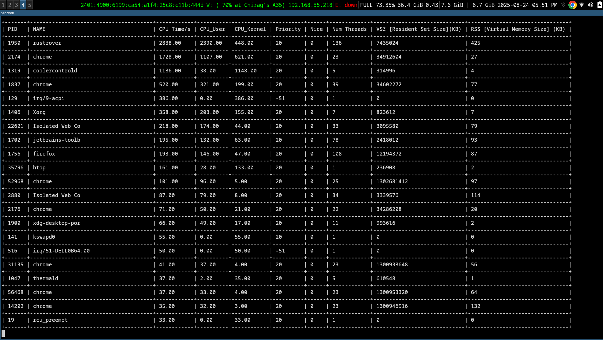

# ProcMan

[](https://crates.io/crates/procmon)
[](LICENSE)
[](https://www.rust-lang.org/)

**ProcMan** is a terminal-based process monitor written in Rust, inspired by `top` and `htop`.  
It allows you to view running processes, CPU and memory usage, number of threads, and process priority in real-time.

---


## Features

- Real-time process monitoring with auto-refresh
- CPU usage per process (user/kernel)
- Memory usage (RSS/VSZ)
- Process priority and nice values
- Number of threads per process
- Terminal-based interface using `crossterm`
- Lightweight and fast

---

## Installation

### Using Cargo

If you have Rust and Cargo installed, you can install ProcMan globally:

```bash
cargo install procmon
```


## Download Precompiled Binaries

If you do not have Rust and Cargo installed, download precompiled binaries from GitHub Releases:

[GitHub Releases](https://github.com/chiragkpoojary/ProcMan/releases)

After downloading, make it executable (Linux/macOS):

```bash
chmod +x procmon
./procmon
